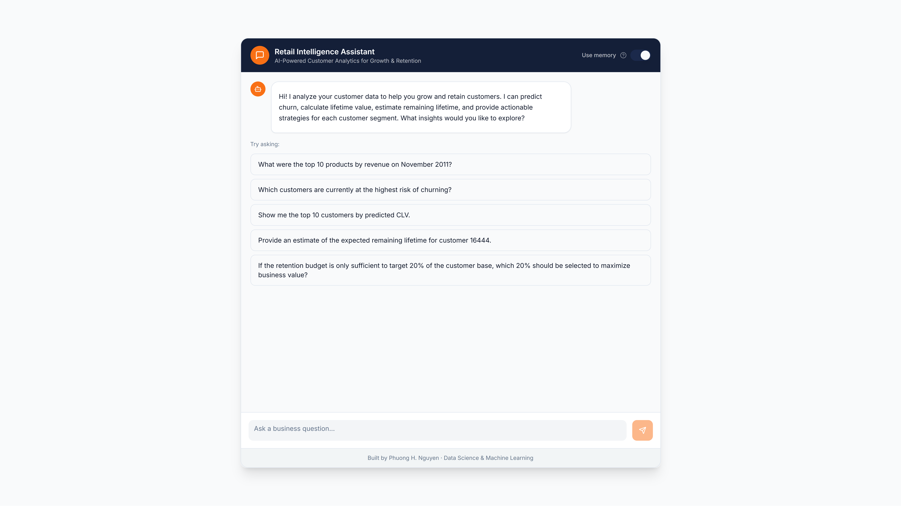

# AI analyst for customer growth & retention – Retail Data Chat Application


A full-stack monorepo with a FastAPI backend and React frontend that delivers AI-powered retail analytics, conversational insights, and customer growth & retention intelligence.

## 🔄 Previous Version
> 
> **[🔗 Legacy Repository](https://github.com/nhphuong2504/AI-assistant)**

## 🎥 Demo

<a href="https://youtu.be/0CBPu7cR1ss">
  
</a>


## ✨ Key Features

### Basic Features

- **🤖 AI-Powered Chat Interface** - Ask questions about your retail data in natural language
- **💬 Conversation Memory** - Context-aware responses with thread-based conversation history
- **🔍 SQL Query Interface** - Direct database querying with read-only access for data exploration
- **📊 Database Schema Exploration** - View and understand your database structure through the API
- **🌐 Modern Web Interface** - Beautiful React-based UI with real-time chat interactions
- **⚡ Fast API Responses** - FastAPI backend with async support for quick query processing
- **🔒 CORS Enabled** - Seamless frontend-backend communication configured out of the box

## 📈 Advanced Insight Analytics

The application includes sophisticated analytics modules for deep customer insights:

### Customer Lifetime Value (CLV) Analysis

- **BG/NBD Model** - Predicts customer purchase frequency and probability of being alive
- **Gamma-Gamma Model** - Estimates average order value per customer
- **RFM Analysis** - Recency, Frequency, Monetary value segmentation
- **CLV Prediction** - Forecast customer lifetime value over specified time horizons

### Survival Analysis & Churn Prediction

- **Cox Proportional Hazards Model** - Identifies factors affecting customer churn risk
- **Kaplan-Meier Estimation** - Non-parametric survival curve analysis
- **Customer Risk Scoring** - Leakage-free risk scoring for active customers
- **Expected Remaining Lifetime (ERL)** - Monte Carlo simulation (BG/NBD) predicts expected days until churn; 
- **Churn Probability** - Estimates probability of churn within specified time horizons 

### Customer Segmentation

- **Risk-Based Segmentation** - High/Medium/Low risk from Cox model
- **ERL-Based Buckets** - Fixed thresholds: **At-Risk** (0–90 days), **Stable** (91–270), **Valued** (271–720), **VIP** (>720 days)
- **12 Segments** - Combines risk (High/Medium/Low) and ERL bucket (At-Risk, Stable, Valued, VIP), e.g. `High/At-Risk`, `Medium/Valued`, `Low/VIP`
- **Actionable Recommendations** - Segment-specific action tags and recommended strategies 


## 📁 Project Structure

```
AI-assistant-ver-2/
├── backend/              # FastAPI backend application
│   ├── app/             # Main application code
│   │   ├── main.py      # FastAPI routes and endpoints
│   │   ├── db.py        # Database utilities
│   │   ├── data.py      # Shared data cache (transactions, CLV models)
│   │   └── llm_langchain.py  # LangChain AI agent & Cox model cache
│   ├── analytics/       # Analytics modules (CLV, survival, Monte Carlo ERL)
│   ├── etl/             # Data loading scripts
│   ├── data/            # Data files (CSV, SQLite)
│   ├── requirements.txt # Python dependencies
│   └── test/            # Backend tests
├── frontend/            # React + TypeScript frontend
│   ├── src/
│   │   ├── components/  # React components
│   │   ├── pages/       # Page components
│   │   └── lib/         # API utilities
│   └── public/          # Static assets
├── venv/                # Python virtual environment (root level)
├── setup.bat            # Backend setup script (Windows)
├── setup.sh             # Backend setup script (Linux/Mac)
├── start-backend.bat    # Backend startup script (Windows)
├── start-backend.sh     # Backend startup script (Linux/Mac)
├── start-frontend.bat   # Frontend startup script (Windows)
└── start-frontend.sh    # Frontend startup script (Linux/Mac)
```

## 🏗️ Architecture

### System Overview

```
┌──────────────┐    HTTP/REST API    ┌──────────────┐
│   React      │◄───────────────────►│  FastAPI     │
│  Frontend    │                      │   Backend    │
│  (Port 8080) │                      │  (Port 8000) │
└──────────────┘                      └──────┬───────┘
                                             │
                    ┌────────────────────────┼────────────┐
                    │                        │            │
                    ▼                        ▼            ▼
            ┌──────────────┐      ┌──────────────┐  ┌──────────┐
            │   SQLite     │      │  Analytics   │  │  OpenAI  │
            │  Database    │      │   Modules    │  │    API   │
            └──────────────┘      └──────────────┘  └──────────┘
```

### Backend Flow

```
┌─────────────────────────────────────────────────────┐
│              FastAPI Backend                        │
├─────────────────────────────────────────────────────┤
│  ┌─────────────────────────────────────────────┐  │
│  │         API Layer (main.py)                 │  │
│  │  /ask-langchain  /query  /schema  /clv       │  │
│  │  /survival/score  /churn-probability  etc.  │  │
│  └──────────────────┬──────────────────────────┘  │
│                     │                               │
│  ┌──────────────────▼──────────────────────────┐  │
│  │      Shared Caches (app/data.py)             │  │
│  │  • get_transactions_df()  • get_clv_models() │  │
│  └──────────────────┬──────────────────────────┘  │
│                     │                               │
│  ┌──────────────────▼──────────────────────────┐  │
│  │      LangChain Agent (llm_langchain.py)      │  │
│  │  • Tool selection  • Cox model cache        │  │
│  │  • Memory  • Token usage logging            │  │
│  └──┬──────────┬──────────┬──────────┬────────┘  │
│     ▼          ▼          ▼          ▼             │
│  ┌──────┐  ┌────────┐  ┌────────┐  ┌──────────┐  │
│  │ SQL  │  │  CLV   │  │ Churn  │  │Segmentation│ │
│  │Query │  │Module  │  │Module  │  │  Module   │  │
│  └──┬───┘  └────┬───┘  └────┬───┘  └─────┬─────┘  │
└─────┼───────────┼───────────┼────────────┼─────────┘
      ▼           ▼           ▼            ▼
┌──────────┐ ┌──────────┐ ┌──────────┐ ┌──────────┐
│ SQLite   │ │ Pandas   │ │ Pandas   │ │ Pandas   │
│ Database │ │DataFrames│ │DataFrames│ │DataFrames│
└──────────┘ └──────────┘ └──────────┘ └──────────┘
```

### Data Flow

```
User Question
     │
     ▼
┌──────────────┐
│ ChatContainer│
└──────┬───────┘
       │
       ▼
┌──────────────┐
│  API Client  │ POST /ask-langchain
└──────┬───────┘
       │
       ▼
┌──────────────┐
│ LangChain    │ Analyze → Select Tool
│ Agent        │
└──────┬───────┘
       │
   ┌───┴───┐
   │       │
   ▼       ▼
┌─────┐ ┌──────────┐
│ SQL │ │Analytics │
│Query│ │Functions │
└──┬──┘ └────┬─────┘
   │         │
   └────┬────┘
        │
        ▼
┌──────────────┐
│  OpenAI LLM  │ Generate Response
└──────┬───────┘
       │
       ▼
┌──────────────┐
│ API Response │
└──────┬───────┘
       │
       ▼
┌──────────────┐
│ ChatMessage  │ Display Answer
└──────────────┘
```

## 📊 Dataset

This application uses the **Online Retail** dataset from the UCI Machine Learning Repository. This is a transactional data set which contains all the transactions occurring between 01/12/2010 and 09/12/2011 for a UK-based and registered non-store online retail. The company mainly sells unique all-occasion gifts. Many customers of the company are wholesalers.

**Dataset Source:** [UCI Machine Learning Repository - Online Retail](https://archive.ics.uci.edu/dataset/352/online+retail)

The raw CSV data is located at `backend/data/raw/online_retail.csv` and is processed into a SQLite database during setup.

## 🚀 Quick Start

### Prerequisites

- **Python 3.8+** installed
- **Node.js 18+** and npm installed
- **OpenAI API Key** (for AI features)

### Backend Setup

1. **Run the setup script:**
   
   **Windows:**
   ```bash
   setup.bat
   ```
   
   **Linux/Mac:**
   ```bash
   chmod +x setup.sh
   ./setup.sh
   ```
   
   This will:
   - Create a Python virtual environment at the root (`venv/`)
   - Install all Python dependencies from `backend/requirements.txt`

2. **Configure environment variables:**
   - Copy `backend/.env.example` to `backend/.env`
   - Add your OpenAI API key:
     ```
     OPENAI_API_KEY=your_api_key_here
     OPENAI_MODEL=gpt-4o-mini
     API_URL=http://127.0.0.1:8000
     DATABASE_PATH=backend/data/retail.sqlite
     ```

3. **Generate the database:**
   The `retail.sqlite` database file is not included in the repository. You need to generate it from the CSV data:
   
   **Windows:**
   ```bash
   cd backend
   ..\venv\Scripts\python etl\load_online_retail.py
   ```
   
   **Linux/Mac:**
   ```bash
   cd backend
   ../venv/bin/python etl/load_online_retail.py
   ```
   
   This script will:
   - Read the CSV file from `backend/data/raw/online_retail.csv`
   - Clean and process the data
   - Create `backend/data/retail.sqlite` with two tables:
     - `transactions_all` - All raw transactions with data quality flags
     - `transactions` - Clean transactions for analytics (excludes cancellations, returns, invalid data)
   - Create indexes for optimal query performance

4. **Start the backend server:**
   
   **Windows:**
   ```bash
   start-backend.bat
   ```
   
   **Linux/Mac:**
   ```bash
   chmod +x start-backend.sh
   ./start-backend.sh
   ```
   
   The backend will run on `http://127.0.0.1:8000`

### Frontend Setup

1. **Start the frontend development server:**
   
   **Windows:**
   ```bash
   start-frontend.bat
   ```
   
   **Linux/Mac:**
   ```bash
   chmod +x start-frontend.sh
   ./start-frontend.sh
   ```
   
   This will automatically install Node.js dependencies if needed and start the dev server.


The frontend will run on `http://localhost:8080`

## 🐍 Virtual Environment

### Manual Activation (if needed)

**Windows:**
```bash
venv\Scripts\activate
```

**Linux/Mac:**
```bash
source venv/bin/activate
```

After activation, you can run Python commands directly. The setup and startup scripts handle activation automatically.

## 🔧 Technology Stack

### Backend
- **FastAPI** - Modern Python web framework
- **LangChain** - AI agent framework
- **LangGraph** - Agent orchestration
- **LangChain Community** - Token usage callbacks (OpenAI)
- **OpenAI** - LLM integration
- **SQLite** - Database
- **Pandas** - Data manipulation
- **Uvicorn** - ASGI server
- **lifelines** - Survival analysis (Cox, Kaplan-Meier)
- **lifetimes** - CLV models (BG/NBD, Gamma-Gamma)

### Frontend
- **React 18** - UI framework
- **TypeScript** - Type safety
- **Vite** - Build tool
- **Tailwind CSS** - Styling
- **shadcn/ui** - UI components
- **React Router** - Routing
- **TanStack Query** - Data fetching

## 📡 API Endpoints

### Main Endpoints

- `POST /ask-langchain` - Ask questions to the AI assistant (LangChain agent with tools; token usage logged per request)
  ```json
  {
    "question": "What are the top customers?",
    "use_memory": true,
    "thread_id": "default"
  }
  ```

- `POST /query` - Execute SQL queries (read-only)
- `GET /schema` - Get database schema
- `GET /health` - Health check
- `POST /ask-langchain/clear-memory` - Clear conversation memory

### Analytics Endpoints

- `POST /clv` - Customer Lifetime Value predictions (BG/NBD + Gamma-Gamma; cached by cutoff date)
- `POST /survival/km` - Kaplan-Meier survival curve
- `POST /survival/score` - Churn risk scoring
- `POST /survival/churn-probability` - Churn probability in next X days 
- `POST /survival/expected-lifetime` - Expected remaining lifetime in days (Monte Carlo ERL)
- `POST /survival/segmentation` - Risk + ERL segmentation 

See `backend/app/main.py` for request/response schemas and full API documentation.

## 🛠️ Development

### Backend Development

The backend uses FastAPI with auto-reload enabled. Changes to Python files will automatically restart the server.

### Database Setup

If you need to regenerate the `retail.sqlite` database (e.g., after modifying the ETL script or CSV data):

**Windows:**
```bash
cd backend
..\venv\Scripts\python etl\load_online_retail.py
```

**Linux/Mac:**
```bash
cd backend
../venv/bin/python etl/load_online_retail.py
```

**Note:** The database file (`backend/data/retail.sqlite`) is excluded from version control via `.gitignore`. Each developer needs to generate it locally using the ETL script.

### Performance & Caching

The backend caches heavy computations to avoid redundant work:

- **Transactions** – `app/data.py` caches the transactions DataFrame; all endpoints and the LangChain agent use `get_transactions_df()`.
- **CLV models** – RFM + BG/NBD + Gamma-Gamma are cached by `cutoff_date` via `get_clv_models(cutoff_date)`; used by `/clv`, expected-lifetime, and LLM CLV/ERL/retention tools.
- **Cox model** – Fitted Cox model is cached (1-hour TTL) in `llm_langchain.py` via `get_or_fit_cox_model()`; used by survival score, churn-probability, segmentation, and LLM risk/churn/segmentation tools.

### Frontend Development

The frontend uses Vite with hot module replacement. Changes to React components will update in the browser automatically.


## 📝 Configuration

### Backend Environment Variables

Create `backend/.env` with:
- `OPENAI_API_KEY` - Your OpenAI API key (required)
- `OPENAI_MODEL` - Model to use (default: `gpt-4o-mini`)
- `API_URL` - Backend URL (default: `http://127.0.0.1:8000`)
- `DATABASE_PATH` - Path to SQLite database

### Frontend Environment Variables

Create `frontend/.env` with:
- `VITE_API_URL` - Backend API URL (default: `http://127.0.0.1:8000`)

⚠️ Never commit `.env` files. Add `backend/.env` and `frontend/.env` to `.gitignore`.


